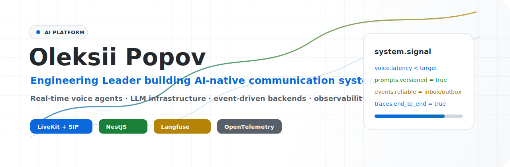
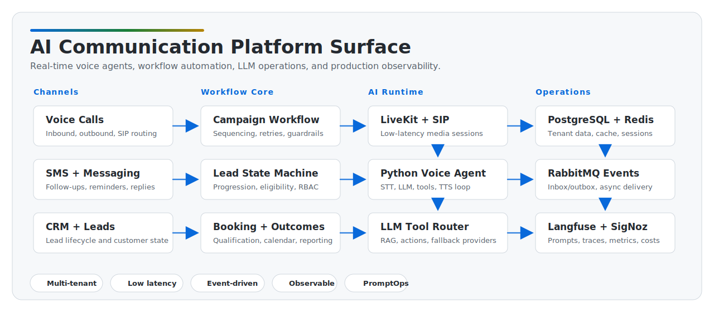

<picture>
  <source media="(prefers-color-scheme: dark)" srcset="./images/hero-dark.svg">
  <source media="(prefers-color-scheme: light)" srcset="./images/hero-light.svg">
  
</picture>

  <a href="https://www.linkedin.com/in/oleksii-popov-developer/">
    <picture>
      <source media="(prefers-color-scheme: dark)" srcset="https://img.shields.io/badge/LinkedIn-Oleksii%20Popov-1F6FEB?style=for-the-badge&logo=linkedin&logoColor=white&labelColor=161B22">
      
    </picture>
  </a>
  <a href="https://github.com/OleksiiPopovDev">
    <picture>
      <source media="(prefers-color-scheme: dark)" srcset="https://img.shields.io/badge/GitHub-OleksiiPopovDev-30363D?style=for-the-badge&logo=github&logoColor=F0F6FC&labelColor=161B22">
      
    </picture>
  </a>
  <a href="https://orcid.org/0000-0003-1213-6880">
    <picture>
      <source media="(prefers-color-scheme: dark)" srcset="https://img.shields.io/badge/ORCID-0000--0003--1213--6880-3FB950?style=for-the-badge&logo=orcid&logoColor=0D1117&labelColor=161B22">
      
    </picture>
  </a>
  <a href="https://leetcode.com/u/Oleksii-Popov/">
    <picture>
      <source media="(prefers-color-scheme: dark)" srcset="https://img.shields.io/badge/LeetCode-Oleksii--Popov-F2CC60?style=for-the-badge&logo=leetcode&logoColor=0D1117&labelColor=161B22">
      
    </picture>
  </a>

  <picture>
    <source media="(prefers-color-scheme: dark)" srcset="https://komarev.com/ghpvc/?username=OleksiiPopovDev&style=flat-square&label=Profile%20views&color=58A6FF">
    
  </picture>
  <picture>
    <source media="(prefers-color-scheme: dark)" srcset="https://img.shields.io/badge/Experience-12%2B%20years-3FB950?style=flat-square&labelColor=161B22">
    
  </picture>
  <picture>
    <source media="(prefers-color-scheme: dark)" srcset="https://img.shields.io/badge/Focus-AI%20platforms%20%26%20voice%20agents-F2CC60?style=flat-square&labelColor=161B22">
    
  </picture>
  <picture>
    <source media="(prefers-color-scheme: dark)" srcset="https://img.shields.io/badge/Base-Portugal-1F6FEB?style=flat-square&labelColor=161B22">
    
  </picture>

  <a href="https://git.io/typing-svg">
    <picture>
      <source media="(prefers-color-scheme: dark)" srcset="https://readme-typing-svg.demolab.com?font=JetBrains+Mono&weight=600&size=18&duration=2600&pause=900&center=true&vCenter=true&width=920&height=36&color=58A6FF&lines=Engineering+Leader+building+AI-native+products;Real-time+voice+agents+%7C+LLM+systems+%7C+event-driven+platforms;NestJS+%2B+Python+%2B+LiveKit+%2B+Langfuse+%2B+OpenTelemetry">
      
    </picture>
  </a>

## Now

| Focus | Current direction |
|---|---|
| AI communication systems | Building CallAiris as a multi-tenant platform for calls, SMS, messaging, lead workflows, and booking automation |
| Real-time voice agents | Hardening LiveKit/SIP agent flows with STT, LLM tools, TTS, fallback behavior, and outcome detection |
| LLM operations | Treating prompts, traces, evals, cost visibility, and provider routing as production infrastructure |
| Engineering leadership | Turning product ambiguity into architecture, delivery rhythm, review standards, and observable systems |

## What I Build

I build production AI systems where product, infrastructure, and engineering execution meet: real-time voice agents, multi-channel lead workflows, self-hosted LLM infrastructure, prompt operations, observability, and reliable event-driven backend platforms.

| Area | What it means in practice |
|---|---|
| AI communication platforms | Live calls, SMS, messaging, lead workflows, CRM and telephony integrations |
| Real-time voice AI | LiveKit agents, SIP, STT/TTS provider routing, low-latency call flows, fallback behavior |
| LLM infrastructure | vLLM, Qwen, OpenAI-compatible APIs, OpenRouter/OpenAI fallbacks, prompt versioning |
| Backend platforms | NestJS, PostgreSQL, RabbitMQ, Redis, transactional inbox/outbox, RBAC, workflows |
| Product dashboards | Next.js, React, Tailwind, React Query, charts, live operational surfaces |
| Engineering systems | Docker, CI/CD, Vault, OpenTelemetry, SigNoz, Langfuse, Trivy, GitHub Actions |

## Featured AI Systems

| System | What it does | Engineering surface |
|---|---|---|
| CallAiris | Multi-tenant AI communication platform for automated sales outreach and lead conversion | NestJS, PostgreSQL, RabbitMQ, Redis, LiveKit, Python agents, Langfuse, OpenTelemetry |
| Voice Agent Runtime | Low-latency inbound/outbound phone agents with tool execution, provider fallback, and post-call analysis | LiveKit Agents, SIP, STT/TTS providers, LLM routing, RAG, outcome detection |
| LLM Ops Layer | Prompt management, tracing, debugging, cost visibility, and model/provider governance for AI workflows | Langfuse, SigNoz, vLLM, Qwen, OpenAI-compatible APIs, OpenRouter/OpenAI fallbacks |
| Delivery Platform | Repeatable build, deploy, and verification path for backend, frontend, agents, and infrastructure | Docker, GitHub Actions, GHCR, Vault, health checks, Trivy, verification gates |

## AI Platform Map

**CallAiris** is the main system I am building: a multi-tenant AI communication platform for automated sales outreach. It handles the full lead lifecycle across live phone calls, SMS, messaging, workflow progression, booking, CRM integration, and post-call analysis.

<picture>
  <source media="(prefers-color-scheme: dark)" srcset="./images/ai-platform-map-dark.svg">
  <source media="(prefers-color-scheme: light)" srcset="./images/ai-platform-map-light.svg">
  
</picture>

## Core Stack

  
  
  
  
  
  
  

  
  
  
  
  
  

  
  
  
  
  
  
  
  
  
  
  
  
  

## Engineering Principles

| Principle | How I apply it |
|---|---|
| Latency is product quality | Real-time voice systems need low-latency STT, LLM, TTS, network, and tool execution |
| Reliability belongs in architecture | Inbox/outbox, retries, idempotency, health checks, typed contracts, and explicit fallbacks |
| AI needs operations | Prompt versioning, evals, traces, cost visibility, observability, and provider routing |
| Teams ship systems | Clear boundaries, pragmatic process, review discipline, and delivery rhythm matter |

## Engineering Operating Model

| Layer | How I run it |
|---|---|
| Product signal | Convert messy business workflows into explicit states, events, ownership, and measurable outcomes |
| Architecture | Keep service boundaries, contracts, queues, persistence, and failure modes visible early |
| AI operations | Version prompts, trace model behavior, compare providers, watch costs, and design fallback paths |
| Delivery | Use CI/CD, typed contracts, health checks, migrations, and verification gates before release |
| Team execution | Align engineers around review quality, small shippable increments, and operational accountability |

## Selected Work Patterns

- Designed event-driven NestJS services with PostgreSQL, RabbitMQ, Redis, TypeORM, and transactional inbox/outbox delivery.
- Built Python LiveKit voice agents for inbound/outbound calls with dynamic tools, RAG, outcome detection, and LLM fallback behavior.
- Integrated Langfuse as a prompt management and observability layer for production AI workflows.
- Built shared system contracts for TypeScript and Python consumers: event schemas, RabbitMQ metadata, tag taxonomy, validators.
- Shipped operational dashboards with Next.js, React, Tailwind, React Query, charts, workflow diagrams, and protected auth flows.
- Automated Docker/GitHub Actions/GHCR deployment paths with Vault-managed secrets and verification gates.

## GitHub Signals

  <picture>
    <source
      srcset="https://github-readme-stats.vercel.app/api?username=OleksiiPopovDev&show_icons=true&hide=stars,issues&theme=github_dark&bg_color=0D1117&title_color=58A6FF&text_color=C9D1D9&icon_color=3FB950&border_color=30363D&hide_border=false&rank_icon=github&line_height=27&card_width=520"
      media="(prefers-color-scheme: dark)"
    />
    
  </picture>
  <picture>
    <source
      srcset="https://github-readme-stats.vercel.app/api/top-langs/?username=OleksiiPopovDev&layout=compact&theme=github_dark&bg_color=0D1117&title_color=58A6FF&text_color=C9D1D9&border_color=30363D&hide_border=false&langs_count=6&card_width=420"
      media="(prefers-color-scheme: dark)"
    />
    
  </picture>

<picture>
  <source
    srcset="https://github-readme-streak-stats.herokuapp.com?user=OleksiiPopovDev&theme=github-dark-blue&background=0D1117&border=30363D&stroke=30363D&ring=58A6FF&fire=F2CC60&currStreakLabel=C9D1D9&sideLabels=C9D1D9&dates=8B949E&hide_border=false&short_numbers=true&card_width=1000&card_height=190"
    media="(prefers-color-scheme: dark)"
  />
  
</picture>

<picture>
  <source
    srcset="https://github-readme-activity-graph.vercel.app/graph?username=OleksiiPopovDev&theme=github-dark&bg_color=0D1117&color=C9D1D9&title_color=58A6FF&line=58A6FF&point=3FB950&area=true&area_color=58A6FF&hide_border=false&border_color=30363D&radius=8&height=260"
    media="(prefers-color-scheme: dark)"
  />
  
</picture>

  
<strong>Extended toolbox</strong>

   

  

    
    
    
    
    
    
    
    
    
    
    
    
    
    
    
    
    
    
  

  
<strong>Outside engineering</strong>

   

  I like deep work, clean tools, good music, games, and systems that stay understandable when they grow.

## Connect

  <a href="https://www.linkedin.com/in/oleksii-popov-developer/">
    <picture>
      <source media="(prefers-color-scheme: dark)" srcset="https://img.shields.io/badge/Connect-LinkedIn-1F6FEB?style=for-the-badge&logo=linkedin&logoColor=white&labelColor=161B22">
      
    </picture>
  </a>
  <a href="https://www.buymeacoffee.com/oleksii.popov">
    <picture>
      <source media="(prefers-color-scheme: dark)" srcset="https://img.shields.io/badge/Buy%20me%20a%20coffee-support-F2CC60?style=for-the-badge&logo=buymeacoffee&logoColor=0D1117&labelColor=161B22">
      
    </picture>
  </a>

